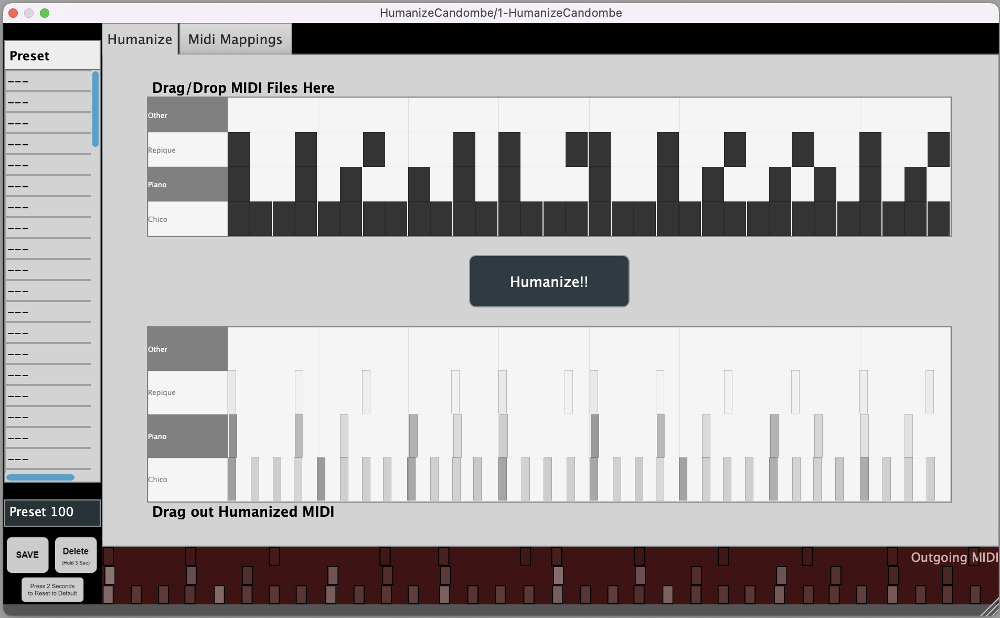
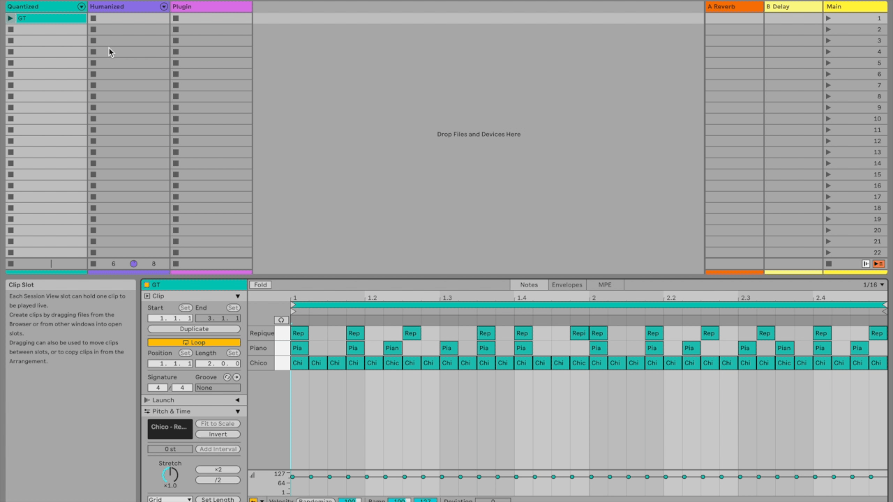

<!---->


##  HumanizeCandombe VST 

HumanizeCandombe VST is a JUCE-based audio plugin project designed to add human-like variations of Candombe to quantized rhythm patterns. This project leverages the transformer model to process MIDI input and outputs more natural and expressive rhythm.

<p align="center">
  
</p>

## Demo

A complete video demonstration of the plugin usage and performance can be found below:

<a href="https://youtu.be/HBgQ2H2ZnPA">
  
</a>

Note: Made using Ableton Live 12 running on Mac (Intel) OS Ventura

Check out our track [Midnight in Montevideo](https://soundcloud.com/styjt-prbhu/midnight-in-montevideo) on SoundCloud!

## Features

- **MIDI Processing**: Processes MIDI input to add human-like variations.
- **Machine Learning Integration**: Utilizes Transformer models for adding groove.
- **Cross-Platform**: Supports macOS, Windows.
- **Plugin Formats**: Available as AU, VST3, and Standalone.

## Installation

### Prerequisites

- **JUCE**: Ensure you have JUCE installed. You can get it from [JUCE's official website](https://juce.com/get-juce).
- **CMake**: Version 3.16 or higher.

### Build Instructions

Run the following commands

```
mkdir build
cmake -B build .
cd build
make
```

This should automatically download JUCE and Torchlib, and the plugin should be available to use as Standalone or VST.


## Usage

### Running the Plugin

1. Open your preferred DAW.
2. Load the HumanizeCandombe VST / AU plugin on a midi track.
3. Drag your midi file into the plugin.
4. Hit the 'Humanize!!' Button.
5. Drag the humanized midi clip from the plugin into your DAW or to an external folder to save as a midi file.

<p align="center">
  
</p>
